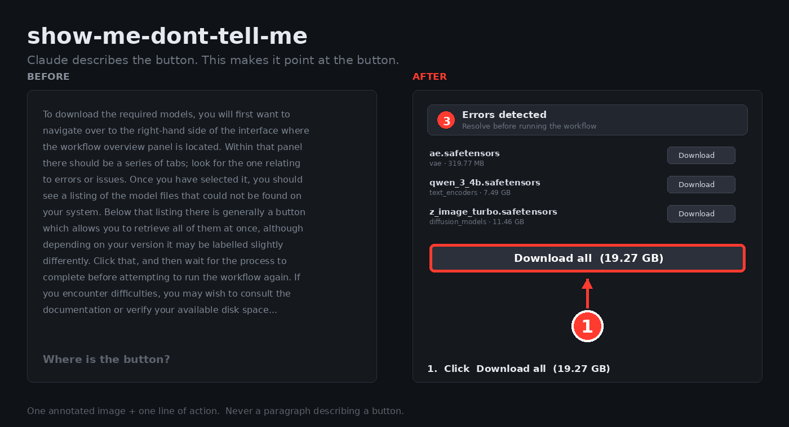

<div align="center">

# show-me-dont-tell-me

### Los asistentes *describen* tu pantalla. Este **la señala**.

Una skill de Claude que responde con capturas anotadas — marcadores numerados, flechas, zoom — en lugar de tres párrafos que adivinan dónde está un botón.

[](LICENSE)
[](INSTALL.md)
[](CHANGELOG.md)

[English](README.md) · [Français](README.fr.md) · [العربية](README.ar.md) · **Español** · [简体中文](README.zh.md)

</div>



---

## El minuto que pierdes, una y otra vez

Preguntas dónde está un ajuste. Te responden esto:

> *«Ve al panel de configuración, localiza la sección Avanzado y busca la opción de descarga cerca del final.»*

Tres frases. Cero píxeles. Sigues teniendo que buscarlo — y si esa respuesta salió del recuerdo de una versión anterior, puede que la opción ni siquiera se llame así ya.

**show-me-dont-tell-me** responde a la misma pregunta con una imagen de **tu** pantalla y un ① rojo puesto sobre el botón exacto.

Un paso = una imagen anotada + una línea de acción. El texto nunca repite lo que la imagen ya muestra.

---

## Instalación en 30 segundos

```bash
claude plugin marketplace add MyKhalijAi/show-me-dont-tell-me
claude plugin install show-me-dont-tell-me
```

Después, simplemente pide:

```
/show-me-dont-tell-me documenta el flujo de registro de mi app
/show-me-dont-tell-me estoy atascado en esta pantalla
/show-me-dont-tell-me por qué esto devuelve un 403
```

Otras plataformas, instalación manual, configuración sin CLI → **[INSTALL.md](INSTALL.md)**

---

## Qué cambia

| Sin | Con |
|---|---|
| «Ve al panel de configuración y localiza la opción de descarga» | Una imagen con un ① rojo sobre el botón exacto |
| Etiquetas inventadas a partir de una versión antigua | Etiquetas leídas de tu pantalla o de tus archivos i18n |
| Solo el camino feliz | Estados vacíos, errores de validación, permiso denegado |
| Capturas publicadas con datos reales de clientes | Ocultar datos es un paso obligatorio, no una revisión final |
| «Esto tardará un rato» | «Unos 25 min a 100 Mbps» |
| Un muro de prosa que hay que descifrar | Una imagen, un gesto, una cosa que comprobar |

---

## Para qué lo usa la gente

**📘 Publicar la guía de usuario que llevas meses posponiendo.** Apúntalo a tu repositorio: lee tus rutas, plantillas y archivos i18n, y produce un tutorial que cubre las pantallas que habrías olvidado — estados de error incluidos.

**🧑‍💻 Formar a alguien sin agendar una llamada.** «Documenta cómo desplegamos» se convierte en un documento numerado e ilustrado, con una señal de verificación después de cada paso.

**🎫 Convertir un ticket de soporte en una respuesta definitiva.** El modo de diagnóstico da causa → solución → verificación, con el error capturado y la solución capturada. Pégalo en tu centro de ayuda y no vuelvas a responderlo.

**🧭 Desatascarte en una interfaz que nunca has visto.** El modo en vivo recaptura tu pantalla antes de cada instrucción, así que nunca te guía por un panel que ya has abandonado.

**🎬 Planificar un screencast antes de darle a grabar.** Planos numerados, una duración para cada uno, y el texto hablado separado del texto en pantalla.

---

## Cuatro modos, elegidos por ti

Determina lo que necesitas antes de hacer nada. El modo decide la densidad de capturas, la estructura y el formato de salida.

| Modo | Se activa con | Salida |
|---|---|---|
| **EN VIVO** | «ayúdame con», «estoy atascado» | mensaje corto + una imagen por paso |
| **DOC** | «documenta esto», «tutorial de mi app» | documento estructurado, imágenes integradas |
| **DIAGNÓSTICO** | un error concreto, «no funciona» | causa → solución → verificación |
| **GUION** | «vídeo», «screencast», «formación» | planos numerados, duración por plano |

También adapta el vocabulario al público — cliente final, equipo interno, o tú mismo dentro de seis meses.

---

## Cinco reglas que nunca rompe

Por eso puedes pegar su resultado directamente en tu documentación:

1. **Nunca describir una interfaz de memoria.** Primero captura real o código fuente. Si no hay nada disponible, lo dice y pregunta — nunca adivina dónde está un botón.
2. **Ocultar antes de anotar.** Correos, claves de API, nombres de clientes, la barra de pestañas del navegador. Difuminado en lugar de tapado, para que el lector siga viendo que ahí hay un campo.
3. **Un número de marcador = un número de paso.** Nunca desincronizados.
4. **Cada paso termina con una señal de verificación** — qué deberías ver para saber que ha funcionado.
5. **Máximo cinco marcadores por imagen.** Si hay más, divide.

Después relee la imagen que acaba de producir y comprueba las cinco, porque un marcador mal colocado es peor que ningún marcador.

---

## Apúntalo a tu propio código — aquí es donde gana

Con acceso a tus fuentes, lee antes de capturar:

- **Archivos i18n, plantillas, constantes** → etiquetas exactas, literales, en el idioma correcto
- **Rutas, controladores, validadores** → las pantallas que nunca se te habría ocurrido mostrar
- **Rutas de error** → lista vacía, campo inválido, cargando, permiso denegado, cuota alcanzada, fallo de red
- **Requisitos previos** → el rol, el dato o el ajuste necesarios antes del paso 1, dichos por adelantado

> El tutorial que se salta el error de validación es el que genera el ticket de soporte.

---

## Hecho para productos reales, no para capturas de demo

- **RTL bien resuelto.** En árabe y hebreo los marcadores pasan a la **izquierda** del objetivo, las flechas apuntan a la derecha y el orden de lectura va de derecha a izquierda — y lo verifica sobre la imagen producida, no de memoria.
- **Accesible por construcción.** El significado nunca lo lleva el color solo: lo lleva el número. Texto alternativo obligatorio en cada imagen. El texto debe seguir siendo legible a la mitad de tamaño.
- **Responde en tu idioma.** Escribe en español y obtienes español — mientras las etiquetas de la interfaz se citan exactamente como aparecen en pantalla.
- **Se mantiene cierto con el tiempo.** Cada tutorial lleva fecha y versión de la app, y el texto nunca se edita sin recapturar la pantalla correspondiente.

---

## La utilidad de anotación

`scripts/annotate.py` — un pequeño envoltorio de Pillow que implementa las convenciones. Sin framework, sin paso de compilación:

```python
from annotate import Annot

(Annot("captura.png")
    .blur(120, 300, 420, 28)        # ocultar primero
    .frame(980, 550, 460, 50)
    .point_at(980, 575, 1)          # marcador + flecha, consciente del RTL
    .crop_around(1100, 500, 1000, 600)
    .save("paso-01-descargar.png"))
```

`set_rtl(True)` invierte la posición de los marcadores y la dirección de las flechas para árabe y hebreo.

---

## El quinto tutorial cuesta una fracción del primero

Una carpeta por producto, para que el trabajo se acumule en lugar de empezar de cero:

```
<producto>/
  capturas/      imágenes en bruto
  anotadas/      imágenes finales
  glosario.md    etiquetas exactas, por idioma
  estilo.md      colores, fuentes, ancho de ventana, datos de demo
  flujos/        un archivo por tutorial
```

Antes de empezar de cero, comprueba si el flujo ya existe y solo necesita una actualización.

---

## Para quién es

Cualquiera que tenga que hacer comprensible una interfaz a otra persona:

- **Desarrolladores** que documentan su propia app sin perder un día en ello
- **Equipos de soporte** que responden la misma pregunta de pantalla cada semana
- **Redactores técnicos** que necesitan capturas que sigan siendo exactas versión tras versión
- **Formadores y docentes** que construyen cursos ilustrados, en cualquier idioma
- **Cualquiera que esté atascado** en un software ahora mismo

---

## Contribuir

La skill cabe en un único archivo Markdown legible — [`SKILL.md`](skills/show-me-dont-tell-me/SKILL.md). Sin compilación, sin dependencias, sin magia. Mejora una convención ahí y aparece en los tutoriales de todo el mundo.

⭐ **Dale una estrella** si te ha ahorrado una captura — así es como otros lo encuentran.

🐛 **Issues y pull requests bienvenidos**, en cualquiera de los cinco idiomas de este README. Ver [CONTRIBUTING.md](CONTRIBUTING.md).

---

## Acerca de

Creado y mantenido por **Dr Maher** en **MyKhalijAi** — herramientas y formación sobre Claude, en árabe, francés, inglés y español.

Contacto: [mykhalijai@gmail.com](mailto:mykhalijai@gmail.com) · [github.com/MyKhalijAi](https://github.com/MyKhalijAi)

El primero de una serie de skills que trabajan a partir de interfaces reales en lugar de la memoria.

## Licencia

MIT — ver [LICENSE](LICENSE). Úsalo comercialmente, bifúrcalo, publícalo.
